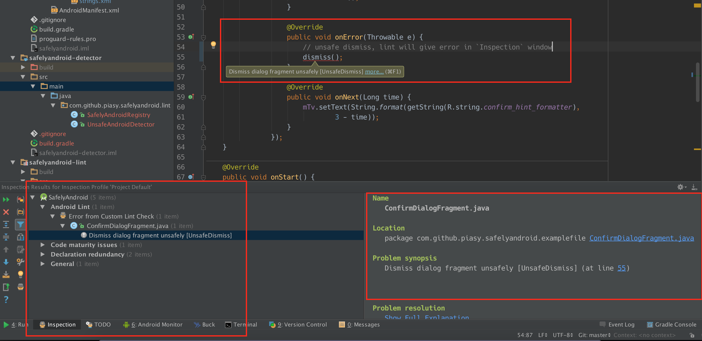

# SafelyAndroid
[  ](https://bintray.com/piasy/maven/SafelyAndroid/_latestVersion)

Build safely Android app, no more Activity not found error and Activity state loss error!

## Pause-safe fragment transaction


## Dependency
Add to gradle dependency of your module build.gradle:

```gradle
repositories {
    jcenter()
}

dependencies {
    compile 'com.github.piasy:safelyandroid:1.1.0'
}
```

## Usage

### Start activity safely
Start activity from context, fragment and support v4 fragment, and start activity for result from
activity, fragment and support v4 fragment, with or without the optional bundle options.
`StartActivityDelegate` will launch the intent only when its component exist, otherwise, it will
return `false`. Never get activity not found error again!

```java
StartActivityDelegate.startActivitySafely(fragment, intent)

StartActivityDelegate.startActivitySafely(fragment, intent, options)

StartActivityDelegate.startActivityForResultSafely(fragment, intent, requestCode)

StartActivityDelegate.startActivityForResultSafely(fragment, intent, requestCode, options)

StartActivityDelegate.startActivitySafely(context, intent)

StartActivityDelegate.startActivitySafely(context, intent, options)

StartActivityDelegate.startActivityForResultSafely(activity, intent, requestCode)

StartActivityDelegate.startActivityForResultSafely(activity, intent, requestCode, options)
```

### Dismiss dialog fragment safely
Dismiss a dialog fragment or support v4 dialog fragment safely. `dialogFragmentDismissDelegate`
will dismiss this dialog fragment only when it's resumed, otherwise, it will return `true` and
dismiss it when `dialogFragmentDismissDelegate.onResumed` is called. Never get activity state
loss error again!

```java
dialogFragmentDismissDelegate.safeDismiss(dialogFragment)

dialogFragmentDismissDelegate.onResumed(dialogFragment)

supportDialogFragmentDismissDelegate.safeDismiss(dialogFragment)

supportDialogFragmentDismissDelegate.onResumed(dialogFragment)
```

### Do fragment transaction safely
Do fragment or support v4 fragment transaction safely. Components (activity, fragment or support
v4 fragment) should implement the `TransactionCommitter` interface, and the fragment transaction
will only be committed when the components is resumed, otherwise it will return true and the
transaction will be committed when `onResumed` is called. Never get activity state loss error again!

```java
fragmentTransactionDelegate.safeCommit(transactionCommitter, transaction)

fragmentTransactionDelegate.onResumed()

supportFragmentTransactionDelegate.safeCommit(transactionCommitter, transaction)

supportFragmentTransactionDelegate.onResumed()
```

### Just extends the safely base components
We provide the default safely components, including `SafelyActivity`, `SafelyDialogFragment`,
`SafelyFragment`, `SafelyAppCompatActivity`, `SafelySupportDialogFragment`, and
`SafelySupportFragment`, which encapsulate safely behaviours above, you can just extends them, and
dismiss dialog fragment with `safeDismiss()`, do fragment transaction with
`safeCommit(transaction)`, then you can build safely Android app now!

### Create your own base components
If your base components must extends other base components, you can make your base component
implement the `TransactionCommitter` interface, and mimic the behaviours of
[safely base components](https://github.com/Piasy/SafelyAndroid/tree/master/safelyandroid/src/main/java/com/github/piasy/safelyandroid/component)
provided by us, then you can also build safely Android app now!

## Lint check
When using `safeCommit`, lint will warn "Missing `commit()` calls", you could disable it.

We provide a custom lint rule, to check the "unsafe `dismiss()` call" of dialog fragment.



Just adding this dependency in your module's `build.gradle`:

```gradle
repositories {
    jcenter()
}

dependencies {
    compile 'com.github.piasy:safelyandroid-lint:1.1.0'
}
```

The suppress of "Missing `commit()` calls" and "unsafe `commit()` call" lint rules may not be added in the long future. :(

## Dev tips
+  You need create an empty file named `bintray.properties` under root project dir, which is used for uploading artifact to bintray.
